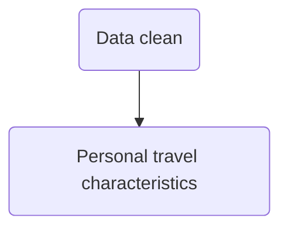
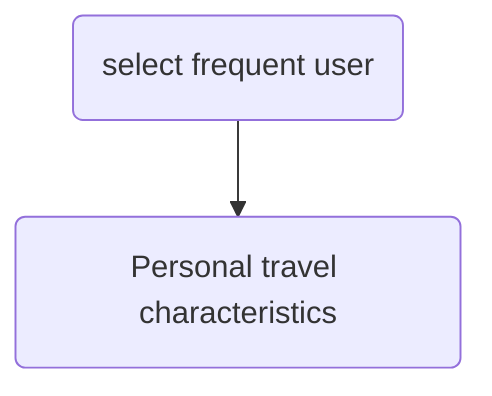

Campus transit lab

* https://transxitlab.osu.edu/campus-transit-lab-0 

Prowl line: [map](https://uwm.edu/transportation/prowllinecommuters/) 

[Feature request - default themes for Python interactive window](https://github.com/Microsoft/vscode-python/issues/3773) 

04/30

* [List Unique Values In A pandas Column - Chris Albon](https://chrisalbon.com/python/data_wrangling/pandas_list_unique_values_in_column/)

* [Creating a new column based on if-elif-else condition](https://stackoverflow.com/questions/21702342/creating-a-new-column-based-on-if-elif-else-condition)

* [Python - Pandas subtotals on groupby](https://stackoverflow.com/questions/47494720/python-pandas-subtotals-on-groupby)

  * [pandas Multi-index and groupbys (article) - DataCamp](https://www.datacamp.com/community/tutorials/pandas-multi-index) 
  * [Pandas .groupby(), Lambda Functions, & Pivot Tables | Python ...](https://mode.com/python-tutorial/pandas-groupby-and-python-lambda-functions/) 
  * pandas.MultiIndex [link](https://pandas.pydata.org/pandas-docs/stable/user_guide/advanced.html) 
  * [Simple demo of Pandas DataFrames and MultiIndex](https://www.somebits.com/~nelson/pandas-multiindex-slice-demo.html)  : df.xs('Apple')
  * Hierarchical Indexing [link](https://jakevdp.github.io/PythonDataScienceHandbook/03.05-hierarchical-indexing.html) 

* [Convert Date String to Day of Week](https://stackoverflow.com/questions/16766643/convert-date-string-to-day-of-week)

  * ```py
    df[Date_Column].dt.weekday_name
    ```

* 

Flowchart

* [mermaid · GitBook](https://mermaidjs.github.io/)




## Data clean

* Drop none value in rows

* Drop useless columns 

* Add extra informations

  * On-Off campus
  * Weekday

  

## Personal travel characteristics

* weekdays categorization
* subtotal---- On Campus count summation
* OD Inferring---- On-off Campus

Park N rider user:

stud = 180 


Trip chan flow




* select frequent user 
  * One way trip  >= 5
* OD  filtering
  * OD difference <= 40%
* Determine OD
  * If Count_O >  Count_D 
    * Choose the most frequent stop as D 
    * Choose the most frequent stop as O
    * Using the smaller count Count_D as trip number
    * If D_max <= 80% of  O_max
      * Choose D_2ndmax as the second origin of the same person
  * If Count_O <  Count_D 
    * versa
* Writing
  * Student ID
  * Origin. 
  * Destination  count