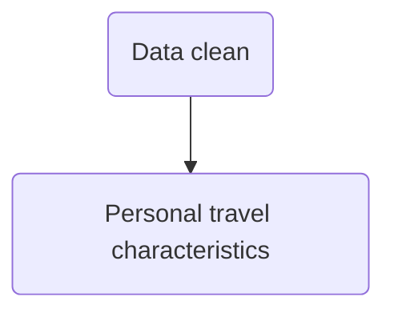
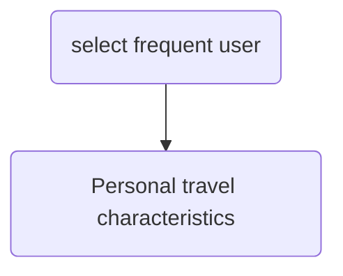

## Script workflow:

* `Geocoder.py` :Using google API to parse address Geolocation (Geocode API results )

  * Inputs 
    * Request record of BOSS (one month)
  * Outputs:
    * Generate output01  `outliers` for  Origin or Destination address
      'boss02_'+OD_type+ '.csv'
    * Generate output02  `outliers` for  Origin or Destination address
      'outliers' +OD_type + '.csv'
  * Runtime: 
    * 46 min for 9900 records

* `Request.py`: Using google API to get the geolocation of fuzzy address  (google search engine result)

  * Input
    * List of address (Bug: address is separated into several pieces due to delimit  ','  )
  * Output 
    * Detailed address information table of the input list 

* `GIS_cluster.py`: Spatial cluster by K-means approach 

  * Features / Tasks
    - [x] Plot points on matplotlib
    - [x] Get the center location of each cluster 
      [K-Means Clustering in Python](https://mubaris.com/posts/kmeans-clustering/) 
      - [ ] radius??
  * Input 
    * Destination points (geojson file )
    * Orgin points (geojson file )

  ````
  inputfile01 = 'Data/boss_trianning.geojson'
  inputfile02 = 'Data/Geojson/boss_destination.geojson'
  ````

  * Output: Geojson file with class information 

  ```
  outfile01 = 'Data/Geojson/02_Origin.geojson'
  outfile02 = 'Data/Geojson/02_Destination.geojson'
  
  ```

* `geopoint_json.py` :  parse the point from shape file to generate a {place: coordination } dictionary

  * Input

    ```
    input01 = 'inprocess_results/prowline stops.shp'\
    ```
  ```
  
  ```
  
* output
  
    ```
    output01  = 'center_prowl.json'
    ```
  
    
  
* `cluster_mapping.py`: generate a cluster based {O ,D ,Flow } file

  * Features / Tasks

    * [x] Generate a `dic_all`  dictionary  which stores {address: Class_[] } information
    * [x] Map the address to cluster using  `dic_all` export to a csv file

  * inputs

    ```
    inputfile01 = 'Data/Geojson/02_Origin.geojson'
    inputfile02 = 'Data/Geojson/02_Destination.geojson'
    
    import pandas as pd
    path  = 'Data/2019_02.csv'
    ```

  * outputs

    ```
    outfile01 = 'Data/Geojson/address_class_dic.json'
    outfile02 = '02_ODflow.csv'
    ```

* `mapping_Geojson.py` generate OD flow based on  {O ,D ,Flow } file

  * Features / Tasks

    * Get the color platte
      * Matplotlib colormap [link](https://matplotlib.org/users/colormaps.html) 
    * Color platte library [link](https://jiffyclub.github.io/palettable/#matplotlib-color-cycle) 
      * [ **Qualitative** palettes](https://jiffyclub.github.io/palettable/colorbrewer/qualitative/#) 

  * Inputs

    ```
    Rela_ad = 'inprocess_results/'
    input01  = 'inprocess_results/centers.json'
    input02  = Rela_ad + '02_ODflow.csv'
    ```

  * outputs

    ```
    outfile01 = Rela_ad + 'flow.geojson'
    ```


* 'Distance_calculator_M.py', calculate distance **matrix**:  based on Waze API

  * Features 

    * Waze not always has response
    * Search multiple times to attain a distance matrix

  * Connection 

    ```
    input01   = 'inprocess_results/points_NB.csv'
    output01  = 'inprocess_results/ODMatrix_NB.csv'
    ```

    

Campus transit lab

* https://transxitlab.osu.edu/campus-transit-lab-0 

Prowl line: [map](https://uwm.edu/transportation/prowllinecommuters/) 

[Feature request - default themes for Python interactive window](https://github.com/Microsoft/vscode-python/issues/3773) 


04/30

* [List Unique Values In A pandas Column - Chris Albon](https://chrisalbon.com/python/data_wrangling/pandas_list_unique_values_in_column/)

* [Creating a new column based on if-elif-else condition](https://stackoverflow.com/questions/21702342/creating-a-new-column-based-on-if-elif-else-condition)

* [Python - Pandas subtotals on groupby](https://stackoverflow.com/questions/47494720/python-pandas-subtotals-on-groupby)

  * [pandas Multi-index and groupbys (article) - DataCamp](https://www.datacamp.com/community/tutorials/pandas-multi-index) 
  * [Pandas .groupby(), Lambda Functions, & Pivot Tables | Python ...](https://mode.com/python-tutorial/pandas-groupby-and-python-lambda-functions/) 
  * pandas.MultiIndex [link](https://pandas.pydata.org/pandas-docs/stable/user_guide/advanced.html) 
  * [Simple demo of Pandas DataFrames and MultiIndex](https://www.somebits.com/~nelson/pandas-multiindex-slice-demo.html)  : df.xs('Apple')
  * Hierarchical Indexing [link](https://jakevdp.github.io/PythonDataScienceHandbook/03.05-hierarchical-indexing.html) 

* [Convert Date String to Day of Week](https://stackoverflow.com/questions/16766643/convert-date-string-to-day-of-week)

  * ```py
    df[Date_Column].dt.weekday_name
    ```

* 

Flowchart

* [mermaid · GitBook](https://mermaidjs.github.io/)




## Data clean

* Drop none value in rows

* Drop useless columns 

* Add extra informations

  * On-Off campus
  * Weekday

  

## Personal travel characteristics

* weekdays categorization
* subtotal---- On Campus count summation
* OD Inferring---- On-off Campus

Park N rider user:

stud = 180 


Trip chan flow




* select frequent user 
  * One way trip  >= 5
* OD  filtering
  * OD difference <= 40%
* Determine OD
  * If Count_O >  Count_D 
    * Choose the most frequent stop as D 
    * Choose the most frequent stop as O
    * Using the smaller count Count_D as trip number
    * If D_max <= 80% of  O_max
      * Choose D_2ndmax as the second origin of the same person
  * If Count_O <  Count_D 
    * versa
* Writing
  * Student ID
  * Origin. 
  * Destination  count