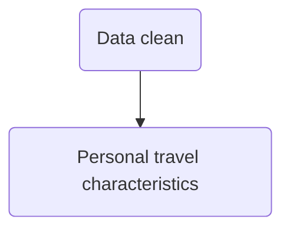

Prowl line: [map](https://uwm.edu/transportation/prowllinecommuters/) 

04/30

* [List Unique Values In A pandas Column - Chris Albon](https://chrisalbon.com/python/data_wrangling/pandas_list_unique_values_in_column/)

* [Creating a new column based on if-elif-else condition](https://stackoverflow.com/questions/21702342/creating-a-new-column-based-on-if-elif-else-condition)

* [Python - Pandas subtotals on groupby](https://stackoverflow.com/questions/47494720/python-pandas-subtotals-on-groupby)

* [Convert Date String to Day of Week](https://stackoverflow.com/questions/16766643/convert-date-string-to-day-of-week)

  * ```py
    df[Date_Column].dt.weekday_name
    ```

* 


Flowchart

* [mermaid · GitBook](https://mermaidjs.github.io/)




## Data clean

* drop none value in rows

* Drop useless columns

* add extra informations

  * On-Off campus
  * weekday

  

## Personal travel characteristics

* weekdays categorization
* subtotal---- On Campus count summation
* OD Inferring---- On-off Campus

Park N rider user:

stud = 180 